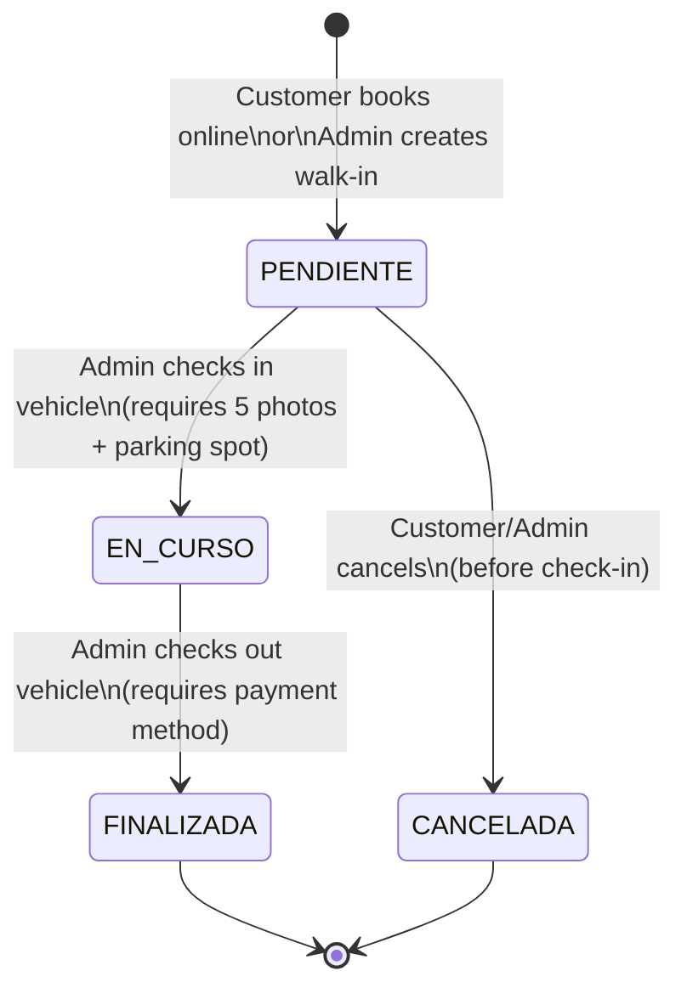

## Overview

Every reservation in PaparcApp follows a **4-state lifecycle** from creation to completion. Each state has specific rules about what actions can be performed and which transitions are allowed.

<Info>
  **Database Table**: `reservation`  
  **Status Column**: `status` (VARCHAR)  
  **DAO**: `models/reservation-dao.js`  
  **Main Controllers**: `adminController.js`, `authController.js`
</Info>

---

## State Diagram



---

## State Definitions

<AccordionGroup>
  <Accordion title="PENDIENTE (Pending)">
    **Meaning**: Reservation created but vehicle has not arrived yet
    
    **Allowed Actions**:
    - ✅ Edit dates, services (customer & admin)
    - ✅ Cancel (customer & admin)
    - ✅ Assign parking spot (admin)
    - ✅ Upload photos (admin)
    - ✅ Start check-in (admin, if requirements met)
    
    **Restrictions**:
    - ❌ Cannot finalize (must be EN CURSO first)
    - ❌ Cannot edit if less than 5 photos for check-in
    - ❌ Cannot start without parking spot assigned
    
    **Created By**:
    - Public booking form (`/booking`)
    - Admin walk-in form (`/admin/reservations/new`)
    
    **Database Insert** (reservation-dao.js:306-324):
    ```sql
    INSERT INTO reservation (
        entry_date, exit_date, status, total_price,
        id_customer, id_vehicle, id_main_service
    ) VALUES ($1, $2, 'PENDIENTE', $4, $5, $6, $7)
    RETURNING id_reservation;
    ```
  </Accordion>
  
  <Accordion title="EN CURSO (In Progress)">
    **Meaning**: Vehicle has checked in and is currently parked in the facility
    
    **Allowed Actions**:
    - ✅ Edit exit date and services (customer & admin)
    - ✅ Update vehicle/customer info (admin)
    - ✅ Upload more photos (admin)
    - ✅ Finalize check-out (admin, with payment)
    
    **Restrictions**:
    - ❌ Cannot cancel (vehicle already inside)
    - ❌ Cannot edit entry date (already happened)
    - ❌ Parking spot cannot be cleared (must remain assigned)
    
    **Entered From**: PENDIENTE via "Receive Vehicle" button
    
    **Entry Date Lock** (authController.js:401):
    ```javascript
    // Customer edit endpoint
    const finalEntryDate = (reserva.status === 'EN CURSO') 
        ? reserva.entry_date  // Use existing date
        : new Date(entry_date); // Allow change for PENDIENTE
    ```
  </Accordion>
  
  <Accordion title="FINALIZADA (Finished)">
    **Meaning**: Vehicle has checked out and customer has paid
    
    **Allowed Actions**:
    - 👁️ View only (read-only for all users)
    
    **Restrictions**:
    - ❌ Cannot edit any fields
    - ❌ Cannot cancel
    - ❌ Cannot upload photos
    - ❌ Cannot change status
    
    **Additional Data Set**:
    - `is_paid` = `true`
    - `payment_method` = `'EFECTIVO'` or `'TARJETA'`
    
    **Entered From**: EN CURSO via "Finalize" button
    
    **Database Update** (reservation-dao.js:502-528):
    ```sql
    UPDATE reservation
    SET status = 'FINALIZADA',
        is_paid = true,
        payment_method = $2
    WHERE id_reservation = $1
    RETURNING id_reservation;
    ```
  </Accordion>
  
  <Accordion title="CANCELADA (Cancelled)">
    **Meaning**: Reservation was cancelled (customer no-show or explicit cancellation)
    
    **Allowed Actions**:
    - 👁️ View only (appears in history)
    
    **Restrictions**:
    - ❌ Cannot edit
    - ❌ Cannot reactivate
    - ❌ Cannot transition to any other state
    
    **Side Effects**:
    - `cod_parking_spot` set to `NULL` (frees parking spot)
    
    **Entered From**: PENDIENTE via "Cancel" button
    
    **Database Update** (reservation-dao.js:438-459):
    ```sql
    UPDATE reservation
    SET status = 'CANCELADA',
        cod_parking_spot = NULL
    WHERE id_reservation = $1
    RETURNING id_reservation;
    ```
  </Accordion>
</AccordionGroup>

---

## State Transitions

### 1. PENDIENTE → EN CURSO (Check-in)

<Steps>
  <Step title="Pre-conditions">
    Admin must ensure:
    1. **Minimum 5 photos** uploaded
    2. **Parking spot assigned** (`cod_parking_spot` not NULL)
    3. Current status is PENDIENTE
  </Step>
  
  <Step title="Trigger Action">
    Admin clicks "Receive Vehicle" button in reservation details page
    
    **Route**: `PATCH /admin/reservations/:id/start`  
    **Controller**: `adminController.js:startReservation()` (line 396-430)
  </Step>
  
  <Step title="Backend Validation">
    ```javascript
    if (reservationInfo.status !== 'PENDIENTE') {
        return res.status(400).json({
            message: 'Only PENDIENTE reservations can be started'
        });
    }
    
    if (!reservationInfo.photos || reservationInfo.photos.length < 5) {
        return res.status(400).json({
            message: 'At least 5 photos required'
        });
    }
    
    if (!reservationInfo.cod_parking_spot) {
        return res.status(400).json({
            message: 'Parking spot must be assigned'
        });
    }
    ```
  </Step>
  
  <Step title="Database Update">
    ```javascript
    const isStarted = await reservationDAO.startReservation(idReservation);
    ```
    
    SQL (reservation-dao.js:469-493):
    ```sql
    UPDATE reservation
    SET status = 'EN CURSO'
    WHERE id_reservation = $1
    RETURNING id_reservation;
    ```
  </Step>
  
  <Step title="Post-conditions">
    - Status badge changes to blue "In Progress"
    - Entry date becomes read-only
    - "Receive Vehicle" button replaced with "Finalize and Check Out"
    - Customer can still edit exit date and services
  </Step>
</Steps>

<Note>
  **Why 5 photos?** This is PaparcApp's business rule to document vehicle condition (front, rear, sides, dashboard, interior) to protect against damage disputes.
</Note>

---

### 2. PENDIENTE → CANCELADA (Cancellation)

<Steps>
  <Step title="Who Can Cancel">
    - **Customer**: Via profile page (if logged in and reservation owner)
    - **Admin**: Via reservation details page
  </Step>
  
  <Step title="Customer Cancellation">
    **Route**: `DELETE /users/profile/reservation/:id/cancel`  
    **Controller**: `authController.js:cancelReservation()` (line 348-379)
    
    ```javascript
    // Verify ownership
    if (!reserva || reserva.id_customer !== userId) {
        return res.status(403).json({ message: 'Not your reservation' });
    }
    
    if (reserva.status !== 'PENDIENTE') {
        return res.status(400).json({
            message: 'Only PENDIENTE reservations can be cancelled'
        });
    }
    
    await reservationDAO.cancelReservation(reservationId);
    ```
  </Step>
  
  <Step title="Admin Cancellation">
    **Route**: `PATCH /admin/reservations/:id/cancel`  
    **Controller**: `adminController.js:cancelReservation()` (line 350-386)
    
    ```javascript
    const allowStatus = ['PENDIENTE'];
    if (!allowStatus.includes(currentReservation.status)) {
        return res.status(400).json({
            message: `Cannot cancel ${currentReservation.status} reservation`
        });
    }
    
    await reservationDAO.cancelReservation(idReservation);
    ```
  </Step>
  
  <Step title="Side Effects">
    - Parking spot freed (`cod_parking_spot = NULL`)
    - Reservation moves to history section
    - Customer may receive cancellation notification (if implemented)
  </Step>
</Steps>

<Warning>
  **No refunds implemented**: Current version does not handle payment processing. Cancellation is a status change only—refund logic must be handled externally.
</Warning>

---

### 3. EN CURSO → FINALIZADA (Check-out)

<Steps>
  <Step title="Trigger Action">
    Admin clicks "Finalize and Check Out" button
    
    **Route**: `PATCH /admin/reservations/:id/finalize`  
    **Controller**: `adminController.js:finalizeReservation()` (line 440-475)
  </Step>
  
  <Step title="Payment Method Selection">
    Frontend shows SweetAlert2 modal with options:
    - **EFECTIVO** (Cash)
    - **TARJETA** (Card)
    
    ```javascript
    const { value: paymentMethod } = await Swal.fire({
        title: 'Select payment method',
        input: 'select',
        inputOptions: {
            'EFECTIVO': 'Cash',
            'TARJETA': 'Card'
        },
        showCancelButton: true
    });
    ```
  </Step>
  
  <Step title="Backend Validation">
    ```javascript
    if (reservationInfo.status !== 'EN CURSO') {
        return res.status(400).json({
            message: 'Only EN CURSO reservations can be finalized'
        });
    }
    
    const validPaymentMethods = ['EFECTIVO', 'TARJETA'];
    if (!validPaymentMethods.includes(paymentMethod)) {
        return res.status(400).json({
            message: 'Invalid payment method'
        });
    }
    ```
  </Step>
  
  <Step title="Database Update">
    ```javascript
    await reservationDAO.finishReservationAndPayment(idReservation, paymentMethod);
    ```
    
    SQL (reservation-dao.js:502-528):
    ```sql
    UPDATE reservation
    SET status = 'FINALIZADA',
        is_paid = true,
        payment_method = $2
    WHERE id_reservation = $1;
    ```
  </Step>
  
  <Step title="Post-conditions">
    - Status badge changes to green "Finished"
    - All action buttons disappear (read-only mode)
    - Reservation appears in admin history
    - Parking spot remains assigned for record-keeping
  </Step>
</Steps>

---

## Photo Evidence Workflow

### Why Photos Are Required

<CardGroup cols={2}>
  <Card title="Customer Protection" icon="shield-check">
    Proves vehicle condition at arrival to avoid false damage claims
  </Card>
  
  <Card title="Business Protection" icon="building-shield">
    Documents pre-existing damage to avoid liability for prior issues
  </Card>
</CardGroup>

### Upload Process

<Steps>
  <Step title="Access Upload Form">
    Only visible in reservation details page for **PENDIENTE** reservations
    
    ```html
    <% if (reservation.status === 'PENDIENTE') { %>
      <div class="upload-form">
        <input type="url" id="photo_url_input" placeholder="Photo URL..." />
        <input type="text" id="photo_desc_input" placeholder="Description" />
        <button id="btn_upload_photo"><i class="bi bi-upload"></i></button>
      </div>
    <% } %>
    ```
  </Step>
  
  <Step title="Submit Photo">
    **POST** `/admin/reservations/:id/photos`  
    **Controller**: `adminController.js:addPhoto()` (line 486-526)
    
    Request body:
    ```json
    {
      "file_path": "https://cloudinary.com/photos/abc123.jpg",
      "description": "Front bumper close-up"
    }
    ```
  </Step>
  
  <Step title="Validation">
    ```javascript
    if (!file_path || file_path.trim() === '') {
        return res.status(400).json({ message: 'Photo URL required' });
    }
    
    // Cannot add photos to finished/cancelled reservations
    if (['FINALIZADA', 'CANCELADA'].includes(reservation.status)) {
        return res.status(400).json({
            message: `Cannot add photos to ${reservation.status} reservation`
        });
    }
    ```
  </Step>
  
  <Step title="Database Insert">
    ```javascript
    await reservationDAO.addPhotoEvidence(id_reservation, file_path, description);
    ```
    
    SQL (reservation-dao.js:539-566):
    ```sql
    INSERT INTO photo_evidence (id_reservation, file_path, description)
    VALUES ($1, $2, $3)
    RETURNING id_photo;
    ```
  </Step>
  
  <Step title="Progress Indicator">
    Upload alert updates:
    ```html
    <div class="upload-alert">
      <span><i class="bi bi-exclamation-triangle"></i> Min. 5 photos</span>
      <strong>3/5 uploaded</strong>  <!-- Live count -->
    </div>
    ```
  </Step>
</Steps>

### Photo Data Model

**Table**: `photo_evidence`

```sql
CREATE TABLE photo_evidence (
    id_photo SERIAL PRIMARY KEY,
    id_reservation INT NOT NULL REFERENCES reservation(id_reservation) ON DELETE CASCADE,
    file_path TEXT NOT NULL,
    description VARCHAR(255),
    taken_at TIMESTAMP DEFAULT CURRENT_TIMESTAMP
);
```

**Fields**:
- `file_path`: URL to image (e.g., Cloudinary, S3, or local path)
- `description`: Optional text (e.g., "Front bumper", "Interior dashboard")
- `taken_at`: Auto-generated timestamp

### Photo Retrieval

Photos are fetched with reservation details:

```javascript
// reservation-dao.js:90-94
const sqlPhotos = `
    SELECT id_photo, file_path, taken_at
    FROM photo_evidence
    WHERE id_reservation = $1
`;

const resultPhotos = await db.query(sqlPhotos, [id]);
reservationData.photos = resultPhotos.rows; // Attached to main object
```

**Frontend Display** (reservation-details.ejs:266-276):
```html
<% reservation.photos.forEach((photo, index) => { %>
  <div class="photo-evidence-card">
    <a href="<%= photo.file_path %>" target="_blank">
      <i class="bi bi-image"></i> <%= photo.description || `Photo ${index + 1}` %>
    </a>
    <span class="photo-date"><%= new Date(photo.taken_at).toLocaleDateString() %></span>
  </div>
<% }) %>
```

---

## Payment Processing

### Current Implementation

<Warning>
  **Simplified Payment**: PaparcApp currently only **records** payment method. No integration with payment gateways (Stripe, PayPal, etc.).
</Warning>

**Payment Fields** in `reservation` table:
- `is_paid` (BOOLEAN): `false` by default, `true` when finalized
- `payment_method` (VARCHAR): `NULL`, `'EFECTIVO'`, or `'TARJETA'`

### Finalization Flow

1. Admin clicks "Finalize"
2. Modal prompts for payment method
3. Admin confirms customer paid (cash/card)
4. Backend sets `is_paid = true` and stores method
5. Reservation moves to FINALIZADA

**No actual charge occurs**—this is a tracking mechanism for cash flow reporting.

### Future Payment Integration

To add real payment processing:

<Steps>
  <Step title="Pre-payment for Online Bookings">
    - Integrate Stripe/PayPal in booking flow
    - Store `payment_intent_id` in database
    - Set `is_paid = true` immediately
  </Step>
  
  <Step title="On-site Payment Terminal">
    - Integrate POS system API
    - Fetch payment status before finalizing
    - Store transaction ID
  </Step>
  
  <Step title="Refund Handling">
    - Add `refund_status` column
    - Implement `PATCH /admin/reservations/:id/refund`
    - Update payment gateway via API
  </Step>
</Steps>

---

## Business Rules Summary

<AccordionGroup>
  <Accordion title="Editing Rules">
    | Status | Entry Date | Exit Date | Services | Vehicle Info | Parking Spot | Photos |
    |--------|-----------|-----------|----------|--------------|--------------|--------|
    | **PENDIENTE** | ✅ | ✅ | ✅ | ✅ (admin) | ✅ | ✅ |
    | **EN CURSO** | ❌ | ✅ | ✅ | ✅ (admin) | ✅ | ✅ |
    | **FINALIZADA** | ❌ | ❌ | ❌ | ❌ | ❌ | ❌ |
    | **CANCELADA** | ❌ | ❌ | ❌ | ❌ | ❌ | ❌ |
  </Accordion>
  
  <Accordion title="Cancellation Rules">
    - Only **PENDIENTE** reservations can be cancelled
    - Customers can cancel their own PENDIENTE bookings
    - Admins can cancel any PENDIENTE booking
    - EN CURSO reservations **cannot** be cancelled (must finalize)
  </Accordion>
  
  <Accordion title="Check-in Requirements">
    All must be met to transition PENDIENTE → EN CURSO:
    1. Status is PENDIENTE
    2. Minimum **5 photos** uploaded
    3. Parking spot assigned (not NULL)
  </Accordion>
  
  <Accordion title="Check-out Requirements">
    All must be met to transition EN CURSO → FINALIZADA:
    1. Status is EN CURSO
    2. Payment method selected (EFECTIVO or TARJETA)
  </Accordion>
  
  <Accordion title="Pricing Rules">
    - Price **always recalculated** on server when editing
    - Client-submitted prices **ignored** (security)
    - Calculated by `pricingService.calculateTotalPrice()`:
      - Base rate from service tier × days
      - Multiplied by vehicle type coefficient
      - Plus additional services (fixed prices)
  </Accordion>
</AccordionGroup>

---

## Database Schema

### Reservation Table

```sql
CREATE TABLE reservation (
    id_reservation SERIAL PRIMARY KEY,
    reservation_date TIMESTAMP DEFAULT CURRENT_TIMESTAMP,
    entry_date TIMESTAMP NOT NULL,
    exit_date TIMESTAMP,
    status VARCHAR(50) NOT NULL DEFAULT 'PENDIENTE',
    total_price DECIMAL(10, 2) NOT NULL,
    is_paid BOOLEAN DEFAULT false,
    payment_method VARCHAR(50),
    notes TEXT,
    cod_parking_spot VARCHAR(20),
    
    id_customer INT NOT NULL REFERENCES customer(id_customer),
    id_vehicle INT NOT NULL REFERENCES vehicle(id_vehicle),
    id_main_service INT NOT NULL REFERENCES main_service(id_main_service)
);
```

**Key Columns**:
- `status`: State machine value
- `is_paid`: Payment flag
- `cod_parking_spot`: Assigned spot code (e.g., "A-15")
- `reservation_date`: When booking was created (audit trail)

### Related Tables

<CodeGroup>
```sql Photo Evidence
CREATE TABLE photo_evidence (
    id_photo SERIAL PRIMARY KEY,
    id_reservation INT NOT NULL REFERENCES reservation(id_reservation) ON DELETE CASCADE,
    file_path TEXT NOT NULL,
    description VARCHAR(255),
    taken_at TIMESTAMP DEFAULT CURRENT_TIMESTAMP
);
```

```sql Additional Services (Many-to-Many)
CREATE TABLE reservation_additional_service (
    id_reservation INT REFERENCES reservation(id_reservation) ON DELETE CASCADE,
    id_additional_service INT REFERENCES additional_service(id_additional_service),
    PRIMARY KEY (id_reservation, id_additional_service)
);
```

```sql Notifications (Future)
CREATE TABLE notification (
    id_notification SERIAL PRIMARY KEY,
    id_reservation INT NOT NULL REFERENCES reservation(id_reservation),
    type VARCHAR(50) NOT NULL,  -- 'REMINDER', 'CONFIRMATION', 'INVOICE'
    sent_at TIMESTAMP DEFAULT CURRENT_TIMESTAMP
);
```
</CodeGroup>

---

## Transaction Safety

All state changes use **database transactions** to ensure atomicity:

```javascript
// reservation-dao.js:140-228 (updateReservationTransaction)
async updateReservationTransaction(id_reservation, updateData) {
    const client = await db.connect();
    
    try {
        await client.query('BEGIN');
        
        // 1. Update reservation table
        await client.query(updateReservationSql, resValues);
        
        // 2. Update vehicle table
        await client.query(updateVehicleSql, vehValues);
        
        // 3. Delete old additional services
        await client.query('DELETE FROM reservation_additional_service WHERE id_reservation = $1', [id_reservation]);
        
        // 4. Insert new additional services
        for (const id_additional_service of updateData.additional_services) {
            await client.query(insertAdditionalServiceSql, [id_reservation, id_additional_service]);
        }
        
        await client.query('COMMIT');
        return true;
        
    } catch(error) {
        await client.query('ROLLBACK');
        throw error;
    } finally {
        client.release();
    }
}
```

<Note>
  If **any step fails** (e.g., foreign key violation), the entire transaction rolls back—no partial updates.
</Note>

---

## Code References

| Feature | File | Line Range |
|---------|------|------------|
| **Start Reservation** | `controllers/adminController.js` | 396-430 |
| **Finalize Reservation** | `controllers/adminController.js` | 440-475 |
| **Cancel Reservation (Admin)** | `controllers/adminController.js` | 350-386 |
| **Cancel Reservation (Customer)** | `controllers/authController.js` | 348-379 |
| **Edit Reservation (Customer)** | `controllers/authController.js` | 382-436 |
| **Add Photo Evidence** | `controllers/adminController.js` | 486-526 |
| **Create Reservation** | `models/reservation-dao.js` | 239-354 |
| **Update Reservation** | `models/reservation-dao.js` | 140-228 |
| **Start DAO Method** | `models/reservation-dao.js` | 469-493 |
| **Finalize DAO Method** | `models/reservation-dao.js` | 502-528 |
| **Cancel DAO Method** | `models/reservation-dao.js` | 438-459 |
| **Add Photo DAO Method** | `models/reservation-dao.js` | 539-566 |
| **Get Full Reservation** | `models/reservation-dao.js` | 65-130 |

---

## Error Scenarios

<CodeGroup>
```javascript Insufficient Photos
if (!reservationInfo.photos || reservationInfo.photos.length < 5) {
    return res.status(400).json({
        success: false,
        message: 'At least 5 photos required to start reservation'
    });
}
```

```javascript Missing Parking Spot
if (!reservationInfo.cod_parking_spot) {
    return res.status(400).json({
        success: false,
        message: 'Parking spot must be assigned before starting'
    });
}
```

```javascript Invalid State Transition
if (reserva.status !== 'PENDIENTE') {
    return res.status(400).json({
        success: false,
        message: 'Only PENDIENTE reservations can be cancelled'
    });
}
```

```javascript Invalid Payment Method
const validPaymentMethods = ['EFECTIVO', 'TARJETA'];
if (!validPaymentMethods.includes(paymentMethod)) {
    return res.status(400).json({
        success: false,
        message: 'Invalid payment method. Accepted: EFECTIVO, TARJETA'
    });
}
```
</CodeGroup>

---

## Best Practices

<CardGroup cols={2}>
  <Card title="Always Recalculate Price" icon="calculator">
    Never trust client-submitted prices. Always recalculate on server using `pricingService.calculateTotalPrice()`
  </Card>
  
  <Card title="Validate State Before Transition" icon="shield-check">
    Check current status before allowing any state change to prevent invalid workflows
  </Card>
  
  <Card title="Use Transactions" icon="database">
    Wrap multi-table updates in BEGIN/COMMIT transactions to ensure data consistency
  </Card>
  
  <Card title="Lock Critical Fields" icon="lock">
    Make entry date read-only when EN CURSO to prevent backdating after check-in
  </Card>
</CardGroup>

---

## Next Steps

<CardGroup cols={3}>
  <Card title="Public Booking" icon="calendar-check" href="/features/public-booking">
    How reservations are created
  </Card>
  
  <Card title="User Profile" icon="user" href="/features/user-profile">
    Customer reservation management
  </Card>
  
  <Card title="Admin Dashboard" icon="gauge" href="/features/admin-dashboard">
    Staff processing workflows
  </Card>
</CardGroup>