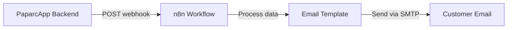

PaparcApp uses n8n (an open-source workflow automation tool) to handle email notifications. The system sends automated emails for reservation events using custom HTML templates.

## Architecture Overview

The notification system follows this flow:



1. **Backend** triggers notification by sending data to n8n webhook
2. **n8n** receives data and processes it through a workflow
3. **Template** is populated with reservation/customer data
4. **Email** is sent to the customer via configured SMTP service

## n8n Setup

### Installation

You can run n8n locally or use the cloud version:

**Local (Docker)**:
```bash
docker run -it --rm \
  --name n8n \
  -p 5678:5678 \
  -v ~/.n8n:/home/node/.n8n \
  n8nio/n8n
```

**Cloud**: Sign up at [n8n.io](https://n8n.io) for a hosted instance.

### Create Webhook Workflow

1. Create a new workflow in n8n
2. Add a **Webhook** node as the trigger
3. Set the webhook method to `POST`
4. Copy the webhook URL (e.g., `https://your-n8n.app/webhook/reserva-confirmada`)

### Configure Email Node

Add an **Email** node to the workflow:

- **SMTP Host**: Your email provider (e.g., `smtp.gmail.com`)
- **SMTP Port**: Usually `587` for TLS
- **Username**: Your email address
- **Password**: App-specific password
- **From Email**: Your sender address
- **To Email**: `{{$json.cliente.email}}` (from webhook data)

<Warning>
For Gmail, you must create an [App Password](https://support.google.com/accounts/answer/185833) instead of using your regular password.
</Warning>

## Backend Integration

### Notification Service

The notification service sends data to n8n:

```javascript services/notificationService.js
const axios = require('axios');

const sendEmailConfirmation = async (datosReserva) => {
    try {
        // n8n webhook URL
        const url = 'http://localhost:5678/webhook-test/reserva-confirmada';
        await axios.post(url, datosReserva);
        console.log('Datos enviados a n8n con éxito');
    } catch (error) {
        console.error('Error al contactar con n8n:', error);
    }
};

module.exports = { sendEmailConfirmation };
```

### Data Structure

The service expects reservation data in this format:

```javascript
const datosReserva = {
    cliente: {
        nombre: 'John Doe',
        email: 'john@example.com',
        telefono: '+34 600 123 456'
    },
    reserva: {
        id_reservation: 'R-12345',
        matricula: 'ABC-1234',
        fecha_entrada: '2024-03-15 10:00',
        fecha_salida: '2024-03-20 18:00',
        precio_total: '125.00',
        is_paid: false
    },
    vehicle: {
        brand: 'Toyota',
        model: 'Camry',
        color: 'Blue'
    },
    main_service: {
        name: 'Standard Parking',
        price: 100.00
    },
    additional_services: [
        { name: 'Car Wash', price: 15.00 },
        { name: 'Tire Check', price: 10.00 }
    ]
};
```

## Email Templates

PaparcApp includes four pre-designed HTML email templates located in `services/templates/`:

### 1. Confirmation Email

**File**: `confirmacion.html`

**Trigger**: When a new reservation is created

**Template variables**:
- `{{ $json.cliente.nombre }}` - Customer name
- `{{ $json.reserva.matricula }}` - License plate
- `{{ $json.reserva.fecha_entrada }}` - Entry date

```html services/templates/confirmacion.html
<h2>Booking Confirmation</h2>
<p>Hello, <strong>{{ $json.cliente.nombre }}</strong>:</p>
<p>Your parking spot has been successfully reserved.</p>
<div style="background-color: #f0f7ff; padding: 20px;">
    <p><strong>License Plate:</strong> {{ $json.reserva.matricula }}</p>
    <p><strong>Entry Date:</strong> {{ $json.reserva.fecha_entrada }}</p>
</div>
```

### 2. Entry Notification

**File**: `entrada.html`

**Trigger**: When vehicle enters the parking facility

**Template variables**:
- `{{ $json.cliente.nombre }}` - Customer name
- `{{ $json.reserva.matricula }}` - License plate
- `{{ $json.reserva.hora_entrada }}` - Entry time

```html services/templates/entrada.html
<h2>Vehicle Received! ✔</h2>
<p>Hello <strong>{{ $json.cliente.nombre }}</strong>,</p>
<p>Your vehicle with license plate {{ $json.reserva.matricula }} has entered our facilities.</p>
<p style="background-color: #f0f7ff; padding: 15px;">
    <strong>Entry Time:</strong> {{ $json.reserva.hora_entrada }}<br>
    <strong>Location:</strong> PaparcApp Main Parking
</p>
```

### 3. Modification Notice

**File**: `modificacion.html`

**Trigger**: When reservation details are updated

**Template variables**:
- `{{ $json.cliente.nombre }}` - Customer name
- `{{ $json.reserva.fecha_entrada }}` - New entry date
- `{{ $json.reserva.fecha_salida }}` - New exit date
- `{{ $json.reserva.precio_total }}` - Updated total price

```html services/templates/modificacion.html
<h2>Your reservation has been modified</h2>
<p>Hello <strong>{{ $json.cliente.nombre }}</strong>,</p>
<p>We confirm that we have updated your stay details as requested.</p>
<table width="100%" style="background-color: #f0f7ff;">
    <tr>
        <td><strong>New Entry:</strong></td>
        <td>{{ $json.reserva.fecha_entrada }}</td>
    </tr>
    <tr>
        <td><strong>New Exit:</strong></td>
        <td>{{ $json.reserva.fecha_salida }}</td>
    </tr>
    <tr>
        <td><strong>Updated Total:</strong></td>
        <td>{{ $json.reserva.precio_total }}€</td>
    </tr>
</table>
```

### 4. Invoice/Receipt

**File**: `factura-final.html` and `templatefactura.html`

**Trigger**: When reservation is completed or invoice is requested

**Template variables**:
- `{d.id_reservation}` - Invoice number
- `{d.customer.full_name}` - Customer name
- `{d.customer.email}` - Customer email
- `{d.license_plate}` - License plate
- `{d.vehicle_brand}` / `{d.vehicle_model}` - Vehicle details
- `{d.total_price}` - Total amount
- `{d.is_paid}` - Payment status
- `{d.additional_services[i]}` - Loop for extra services

```html services/templates/templatefactura.html
<div class="header">
    <h1 class="logo">PaparcApp</h1>
    <div>
        <h2>Booking Receipt</h2>
        <p><strong>Invoice No.:</strong> {d.id_reservation}</p>
    </div>
</div>

<div class="section">
    <div class="col">
        <h3>Customer Information</h3>
        <p><strong>Name:</strong> {d.customer.full_name}</p>
        <p><strong>Email:</strong> {d.customer.email}</p>
    </div>
    <div class="col">
        <h3>Vehicle Details</h3>
        <p><strong>License Plate:</strong> {d.license_plate}</p>
        <p><strong>Model:</strong> {d.vehicle_brand} {d.vehicle_model}</p>
    </div>
</div>

<table>
    <tr>
        <td>Main Service: {d.main_service_name}</td>
        <td>{d.total_price}€</td>
    </tr>
    <!-- Additional services loop -->
    {d.additional_services[i]}
    <tr>
        <td>+ {d.additional_services[i].name}</td>
        <td>{d.additional_services[i].price}€</td>
    </tr>
</table>

<div class="total-box">
    <p class="total-amount">TOTAL: {d.total_price}€</p>
    <p><strong>Status:</strong> {d.is_paid ? 'PAID' : 'PENDING'}</p>
</div>
```

## Notification Events

Here's when each notification is triggered:

| Event | Template | Trigger Point | Data Required |
|-------|----------|---------------|---------------|
| **Booking Created** | `confirmacion.html` | After successful reservation | Customer, reservation, vehicle |
| **Vehicle Entry** | `entrada.html` | Admin marks reservation as "EN CURSO" | Customer, entry timestamp |
| **Reservation Modified** | `modificacion.html` | Customer updates dates/services | Original + updated details |
| **Invoice Request** | `factura-final.html` | Reservation completed or manual request | Full reservation + payment status |

## Production Configuration

### Environment Variables

Add n8n webhook URL to your environment:

```bash .env
# n8n Webhook Configuration
N8N_WEBHOOK_URL=https://your-n8n-instance.app/webhook/reserva-confirmada
```

Update the notification service:

```javascript services/notificationService.js
const sendEmailConfirmation = async (datosReserva) => {
    try {
        const url = process.env.N8N_WEBHOOK_URL || 'http://localhost:5678/webhook-test/reserva-confirmada';
        await axios.post(url, datosReserva);
        console.log('Notification sent successfully');
    } catch (error) {
        console.error('Error sending notification:', error);
        // Optional: Log to monitoring service
    }
};
```

### n8n Cloud Deployment

For production, use n8n Cloud:

1. Sign up at [n8n.cloud](https://n8n.cloud)
2. Import your workflow
3. Configure email credentials in workflow settings
4. Enable webhook with authentication if needed
5. Update `N8N_WEBHOOK_URL` in your backend

<Tip>
Use n8n's built-in error handling to retry failed emails and log errors to your monitoring system.
</Tip>

## Template Customization

To customize email templates:

1. Edit HTML files in `services/templates/`
2. Use n8n's template syntax: `{{ $json.path.to.data }}`
3. Test locally with n8n's test webhook feature
4. Ensure responsive design for mobile email clients

### Brand Colors

PaparcApp uses these brand colors in templates:

```css
:root {
    --azul-corp: #0968EF;    /* Primary blue */
    --verde-corp: #7DDF8B;   /* Accent green */
    --negro: #000000;        /* Text */
    --gris: #D9D9D9;         /* Borders */
    --blanco: #FFFFFF;       /* Background */
}
```

## Testing

### Local Testing

1. Start n8n locally:
   ```bash
   docker run -it --rm --name n8n -p 5678:5678 n8nio/n8n
   ```

2. Create a test workflow with webhook trigger

3. Send test data:
   ```bash
   curl -X POST http://localhost:5678/webhook-test/reserva-confirmada \
     -H "Content-Type: application/json" \
     -d '{
       "cliente": {"nombre": "Test User", "email": "test@example.com"},
       "reserva": {"matricula": "TEST-123", "fecha_entrada": "2024-03-15"}
     }'
   ```

4. Check n8n executions tab for results

### Production Testing

Use n8n's built-in testing features:
- Test webhook endpoints
- Preview email templates with sample data
- Monitor execution logs
- Set up error notifications

## Error Handling

Implement proper error handling for failed notifications:

```javascript
const sendEmailConfirmation = async (datosReserva) => {
    try {
        const url = process.env.N8N_WEBHOOK_URL;
        const response = await axios.post(url, datosReserva, {
            timeout: 10000 // 10 second timeout
        });
        
        console.log('Email sent successfully:', response.data);
        return { success: true };
        
    } catch (error) {
        console.error('Failed to send notification:', error.message);
        
        // Log to monitoring service (e.g., Sentry)
        // Sentry.captureException(error);
        
        // Return error but don't break the main flow
        return { 
            success: false, 
            error: error.message 
        };
    }
};
```

<Warning>
Email failures should not break the reservation process. Always handle notifications asynchronously and log errors for monitoring.
</Warning>

## Next Steps

<CardGroup cols={2}>
  <Card title="Deployment" icon="rocket" href="/guides/deployment">
    Deploy PaparcApp to production with Render
  </Card>
  <Card title="Authentication" icon="shield-halved" href="/guides/authentication">
    Set up user authentication and social login
  </Card>
</CardGroup>